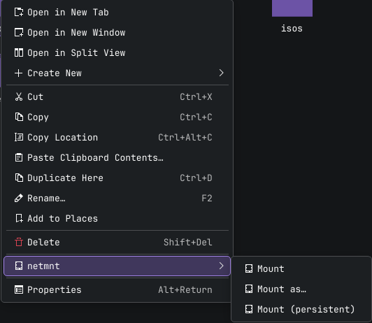

# netmnt · v0.2.0

[](https://github.com/thongor77/netmnt/releases/latest)
[](https://www.rust-lang.org/)
[](LICENSE)
[](#install--try-it-real-mount)
[](#)
[](#)
[](https://www.paypal.com/donate/?business=JFQGY7NU3ANCN&no_recurring=0&item_name=Every+donation%2C+no+matter+how+small%2C+helps+me+keep+this+project+alive.+Thank+you%21%0A&currency_code=EUR)
[](#support-the-project)

Mount network shares (SMB/CIFS and NFS, SSHFS later) from a single click in your
file manager — and unmount them just as easily.

## Problem

Browsing `smb://host/share` in Dolphin gives you a transient KIO/FUSE view, not a
real, predictable mount point usable from the terminal and every other app.
Setting up `mount.cifs`, fstab entries or systemd units by hand is tedious, and
existing GUIs (Smb4K) are standalone apps rather than a right-click action where
you already are.

netmnt adds three actions to the file manager context menu:

- **Mount** — mount the share for this session at a stable path (e.g. `~/mnt/<share>`).
- **Mount as…** — same, with explicit credentials.
- **Mount (persistent)** — register a systemd `.mount` unit so it survives reboot.



## Stack

- **Rust** (workspace, edition 2021)
- **zbus** — D-Bus client/server
- **systemd** — daemon lifecycle + persistent `.mount` units
- **polkit** — privilege authorization
- **KDE ServiceMenus** — Dolphin context-menu integration
- Backend: `mount.cifs` (cifs-utils) and `mount.nfs` (nfs-utils); KWallet for
  SMB credential storage (NFS has none — access is server-ACL based)

## Architecture (short)

```
Dolphin (right-click smb:// or nfs://) → ServiceMenu .desktop → netmnt (CLI, unprivileged)
                                                                   │ D-Bus (system bus)
                                                            netmntd (daemon, privileged)
                                                                   │ polkit-authorized
                                                     mount.cifs / mount.nfs / systemd .mount
```

- `crates/netmnt` — unprivileged CLI client, invoked by the service menu.
- `crates/netmntd` — privileged daemon owning `org.netmnt` on the system bus.
- `crates/netmnt-common` — shared D-Bus types and constants.

Full detail: [`docs/Architecture.md`](docs/Architecture.md).

## Status

**Working (v0.2.0)** — tested end to end against a real NAS, including across a
reboot. Mount (guest), Mount as… (authenticated, via kdialog + KWallet, password
kept out of argv), persistent mounts (systemd `.mount` units that survive reboot),
and Unmount (which also tears down the unit and cleans up the empty mount-point
directory) all work. Mounts are owned by the calling user.

**NFS** (`nfs://host/export`) is also supported: Mount and Mount (persistent)
work the same way, minus credentials — NFS access is controlled by the server's
export ACL (host/network based), not username/password, so `Mount as…` silently
behaves like a plain `Mount` on `nfs://` locations. Ownership on an NFS mount
follows the server's own UID mapping (unlike CIFS, there is no `uid=`/`gid=`
mount option), so the exported folder's Unix permissions need to allow your uid.
SSHFS is next. See [`docs/Roadmap.md`](docs/Roadmap.md).

## Build

```sh
cargo build            # debug
make build             # release binaries used by `make install`
```

## Install & try it (real mount)

> Needs a working SMB share. For a first test use a **guest-readable** share;
> authenticated shares work too via `--ask` (see below).

```sh
make build             # as your user
sudo make install      # binaries + D-Bus/polkit/systemd/servicemenu files
sudo make reload       # refresh systemd + D-Bus

# CLI test (the daemon is D-Bus activated on first call):
netmnt mount smb://nas.local/public
#   → polkit prompts for admin authentication, then:
ls ~/mnt/public
netmnt unmount ~/mnt/public

# Authenticated share ("mount as"): prompts for credentials (kdialog or tty),
# can store them in KWallet, and reuses them next time.
netmnt mount --ask smb://nas.local/wiki

# NFS: no credentials involved — access is granted by the export's ACL on the
# server (e.g. a Synology NFS rule allowing your client's IP/network).
netmnt mount nfs://nas.local/volume1/share
netmnt mount --persistent nfs://nas.local/volume1/share
```

To watch the daemon logs during a test, run it in the foreground instead of
relying on activation:

```sh
sudo /usr/bin/netmntd        # terminal A (logs)
netmnt mount smb://nas.local/public   # terminal B
```

In Dolphin: right-click an `smb://` location → **netmnt → Mount**.

Uninstall: `sudo make uninstall`.

## Troubleshooting

**`umount: /home/<user>/mnt/<share>: must be superuser to unmount.`**

You unmounted from the **Places sidebar** (the "Remote" section) instead of the
file view. That sidebar entry is KDE Solid's own native unmount, which runs as
your regular user — it has no idea about netmnt and can't reach the polkit-authorized
daemon that owns the mount. It cannot be extended with a ServiceMenu, so netmnt
can't hook into it.

Fix: unmount from the **file view** instead — navigate to the parent folder
(e.g. `~/mnt`), right-click the mounted share, and use **netmnt → Unmount**.
That entry goes through the daemon and works correctly.

To stop hitting this by accident, right-click the shortcut in the sidebar and
choose **Hide** — you'll still have the folder itself under `~/mnt` for regular
navigation.

**NFS mount succeeds but every file access is `Permission denied` (mode shows
as `0`).**

The export folder has a POSIX ACL (`ls -ld` shows a trailing `+`) that denies
your uid, overriding the classic Unix `rwx` bits — common on Synology NAS even
without "Windows ACL" in the DSM permissions UI. Check and clear it on the
server:

```sh
getfacl /path/to/export      # or: sudo synoacltool -get /path/to/export
sudo setfacl -b /path/to/export   # or: sudo synoacltool -del /path/to/export
sudo chown <uid>:<gid> /path/to/export
sudo chmod 750 /path/to/export    # or whatever fits your access model
```

Then unmount and remount (a mount already up may hold onto stale attributes
from before the fix).

## Existing alternatives

Evaluated before starting (see `docs/Decisions-Techniques.md`): **Smb4K**,
**kio-fuse**, **gio mount / gvfs**, fstab/systemd. netmnt's niche is the
right-click-to-stable-path workflow driven by a Rust service.

## Support the project

If netmnt is useful to you, consider supporting its development:

- **PayPal** — [Donate via PayPal](https://www.paypal.com/donate/?business=JFQGY7NU3ANCN&no_recurring=0&item_name=Every+donation%2C+no+matter+how+small%2C+helps+me+keep+this+project+alive.+Thank+you%21%0A&currency_code=EUR)
- **Bitcoin** — `bc1qspe0tky7552qas72wgn8w9dswr0dxlv24w39t6ztjqk3nz6kc5tqv753a4`

## License

MIT — see [LICENSE](LICENSE).
